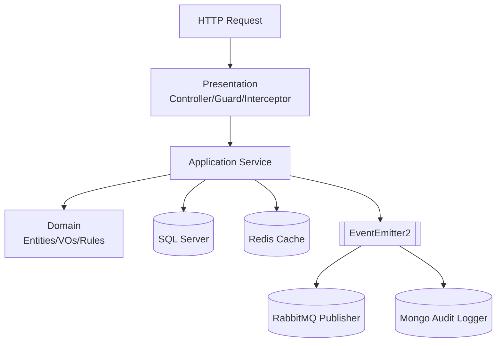

# Aivacol Fleet Management API

Backend do módulo de Gestão de Frota da Aivacol, desenvolvido para o teste técnico de Backend.

> Com o fechamento da Fase 9 (QA/performance baseline), o responsável técnico declara a entrega **v1.0** alcançada para o escopo deste desafio.

## 🎯 Resposta direta às 5 exigências principais do desafio

### 1) Arquitetura limpa

- Implementação em camadas (`Domain`, `Application`, `Presentation`, `Infrastructure`) com desacoplamento por portas/adapters.
- Domínio sem dependência direta de framework, com regras de negócio isoladas.
- Decisões arquiteturais formalizadas em ADRs.
- Mapa de Arquivos do Projeto visualização humana `struct.md`

### 2) Segurança robusta

- JWT obrigatório nas rotas protegidas.
- Rate limiting global por ambiente (`THROTTLE_TTL_SECONDS`, `THROTTLE_LIMIT`).
- Tratamento padronizado de erros com `code` estável e `correlationId`.

### 3) Testes automatizados

- Suites unitárias e E2E passando.
- Cobertura global acima dos thresholds definidos (`lines/functions/statements >= 90%`, `branches >= 80%`).
- Gates de qualidade (`lint`, `typecheck`, testes) validados localmente e no CI.

### 4) Escalabilidade

- Cache Redis em leitura de veículos com invalidação automática.
- Mensageria RabbitMQ para eventos de integração sem bloquear transação principal.
- Baseline de performance com cenários `cold`, `warm`, `capacity` e `write-focused`.

### 5) Padronização da modelagem

- Metadados obrigatórios (`created_at`, `updated_at`, `created_by`) na modelagem persistida.
- Soft delete com unicidade de ativos no SQL Server via índices filtrados (`deleted_at IS NULL`).
- Value Objects para campos críticos (`license plate`, `chassis`, `renavam`).

## ✅ Checklist do Desafio (Obrigatórios + Bônus + Diferenciais)

| Critério                                                          | Status | Observação objetiva                    |
| ----------------------------------------------------------------- | ------ | -------------------------------------- |
| Node.js 18+                                                       | ✅     | Runtime em container                   |
| NestJS 10+                                                        | ✅     | Framework principal da API             |
| TypeORM + SQL Server                                              | ✅     | Persistência relacional com migrations |
| JWT obrigatório                                                   | ✅     | Login + proteção das rotas de negócio  |
| Seed com usuário padrão `aivacol`                                 | ✅     | Seed idempotente                       |
| `models` (obrigatório)                                            | ✅     | CRUD completo + metadados              |
| `vehicles` (obrigatório)                                          | ✅     | CRUD completo + metadados              |
| Metadados obrigatórios (`created_at`, `updated_at`, `created_by`) | ✅     | Aplicados na modelagem                 |
| Cache Redis em consultas de veículos                              | ✅     | Listagem e busca por ID                |
| Expiração de cache via env                                        | ✅     | TTL configurável                       |
| Invalidação automática de cache em mutações                       | ✅     | `create/update/delete`                 |
| Testes automatizados (Jest unit + e2e)                            | ✅     | Suites verdes                          |
| Tratamento de erros e exceções                                    | ✅     | Filtro global + catálogo estável       |
| Boas práticas REST                                                | ✅     | Contratos e status codes consistentes  |
| `seed_vehicles.json` no repositório                               | ✅     | Arquivo presente na raiz               |
| Scripts de execução para avaliador                                | ✅     | Scripts PowerShell + Docker            |

## 🚀 Bônus e diferenciais implementados

| Item                                      | Status | Observação                                                                        |
| ----------------------------------------- | ------ | --------------------------------------------------------------------------------- |
| Health check protegido                    | ✅     | `/api/v1/health` com validação de conectores                                      |
| Swagger/OpenAPI                           | ✅     | `/api/docs` web: http://localhost:3000/api/docs                                   |
| Postman collection final                  | ✅     | Fluxo com token automático                                                        |
| Dockerfile multistage                     | ✅     | Estágios `dev`, `builder` e `production`                                          |
| Docker Compose completo                   | ✅     | Stack com app, SQL Server, Redis, RabbitMQ, MongoDB e benchmark runner            |
| CI (GitHub Actions)                       | ✅     | Gates `lint`, `typecheck` e `test` em push/PR para `main`                         |
| ADRs + trade-offs/drawbacks               | ✅     | Documentados em `docs/adr/*`                                                      |
| Benchmark quente/frio + stress/capacidade | ✅     | Evidenciado em `docs/performance-baseline-phase-9.md`                             |
| Baseline/manifesto de performance         | ✅     | Consolidação oficial em `docs/performance-baseline-phase-9.md`                    |
| Governança e handoff técnico              | ✅     | `MASTER.md`, `implementation_plan.md`, `task.md`, `struct.md`, `ACHIEVEMENTS.md`  |
| Linting e qualidade de código             | ✅     | ESLint + `lint:fix` + `typecheck` como gate de QA contínuo                        |
| Mensageria (RabbitMQ)                     | ✅     | Eventos `vehicle.created` e `vehicle.updated` com retry/backoff e fallback em DLQ |
| Idempotência estrutural                   | ✅     | Seed idempotente, uso de `eventId` e unicidade ativa com soft delete              |
| Governança por PR e manifestos de fase    | ✅     | Entregas por fase com evidências em `ACHIEVEMENTS.md` e checklist em `task.md`    |
| Code review orientado por checklist       | ✅     | Critérios de qualidade, risco e rastreabilidade antes do merge                    |
| Coverage mínimo atingido                  | ✅     | `>=90%` lines/functions/statements e `>=80%` branches                             |

### Por que optei por esses extras?

Os itens bônus foram implementados para reduzir risco técnico e aumentar a qualidade de manutenção do projeto:

- Mensageria e auditoria melhoram rastreabilidade e desacoplamento de responsabilidades.
- Idempotência estrutural melhora confiabilidade em retries (seed, eventos e unicidade ativa).
- CI e suíte de testes robusta aumentam confiança para evolução contínua.
- Swagger e Postman melhoram experiência de validação para recrutador/avaliador.
- Benchmark estruturado permite evidenciar impacto real de cache em desempenho.

Essas decisões estão alinhadas ao planejamento (`MASTER.md`, `implementation_plan.md`, `task.md`) e aos ADRs do projeto.

## Sumário

- [1) Snapshot executivo (o que está pronto)](#1-snapshot-executivo-o-que-está-pronto)
- [2) Trade-offs assumidos (explícitos)](#2-trade-offs-assumidos-explícitos)
- [3) Limitações e riscos atuais](#3-limitações-e-riscos-atuais)
- [4) Como validar em 10 minutos](#4-como-validar-em-10-minutos)
- [5) Evidências objetivas (comandos e resultado esperado)](#5-evidências-objetivas-comandos-e-resultado-esperado)
- [6) Arquitetura operável (happy path + degradação)](#6-arquitetura-operável-happy-path--degradação)
- [7) Baseline de performance (Fase 9)](#7-baseline-de-performance-fase-9)
- [8) Segurança e contrato de erro](#8-segurança-e-contrato-de-erro)
- [9) Qualidade, testes e CI](#9-qualidade-testes-e-ci)
- [10) Endpoints principais](#10-endpoints-principais)
- [11) Scripts para avaliação](#11-scripts-para-avaliação)
- [12) Variáveis de ambiente críticas](#12-variáveis-de-ambiente-críticas)
- [13) Entregas por PR (rastreabilidade)](#13-entregas-por-pr-rastreabilidade)
- [14) Leitura de profundidade](#14-leitura-de-profundidade)
- [15) Continuidade com IA (protocolo)](#15-continuidade-com-ia-protocolo)
- [16) Contato técnico](#16-contato-técnico)

## 1) Snapshot executivo (o que está pronto)

Entrega consolidada em 9 fases com evidência técnica rastreável.

- API REST versionada (`/api/v1`) com autenticação JWT e rotas protegidas.
- CRUD completo de `vehicles` e `models` (obrigatório), `brands` (bônus) e consulta protegida de `users`.
- Cache Redis em leitura de veículos com invalidação automática em mutações.
- Mensageria RabbitMQ para integração assíncrona de eventos de veículos (`vehicle.created`, `vehicle.updated`) sem bloquear transação principal.
- Auditoria operacional em MongoDB de interações de serviço (`AUTH`, `READ`, `MUTATION`).
- Contrato de erro estável com `code`, `statusCode`, `correlationId` e mensagens em PT-BR.
- Governança de entrega com ADRs, fases por PR, checklist técnico e baseline de performance documentado.

## 2) Trade-offs assumidos (explícitos)

### 2.1 EventEmitter2 + listeners resilientes em vez de outbox nesta versão

- Decisão: efeitos secundários (RabbitMQ/MongoDB) são disparados por `EventEmitter2`, com listeners `fire-and-forget` que não relançam exceção.
- Ganho: menor acoplamento e manutenção de disponibilidade do fluxo principal de CRUD no SQL Server. Conformidade com LGPD
- Custo: sem garantia `exactly-once` nesta versão (modelo prático `at-most-once` para efeitos secundários).
- Evolução prevista: outbox pattern quando o requisito de entrega exigir garantia forte.

### 2.2 Soft delete no SQL Server + auditoria complementar no MongoDB

- Decisão: preservar histórico operacional no relacional com `deleted_at`, mantendo trilha de contexto no MongoDB.
- Ganho: rastreabilidade e compliance operacional sem perda de histórico de negócio.
- Custo: maior complexidade em consultas/índices e necessidade de governança de retenção.

### 2.3 Índice único filtrado por SQL raw (ADR-004)

- Decisão: criar unicidade de ativos (`deleted_at IS NULL`) via migration SQL raw no SQL Server.
- Ganho: regra de negócio correta para placa/chassi/renavam com soft delete.
- Custo: acoplamento ao dialeto SQL Server e menor portabilidade imediata.

### 2.4 Escrita síncrona preservada (sem `202 Accepted` nesta release)

- Decisão: manter semântica HTTP síncrona para `create/update/delete` nesta v1.0.
- Ganho: previsibilidade de contrato para avaliador/consumidor atual.
- Custo: write-path com latência de cauda maior sob carga; evolução assíncrona documentada para próxima etapa.

## 3) Limitações e riscos atuais

- Gargalo predominante em carga tende a CPU/event-loop (não I/O de disco) no ambiente de benchmark local.
- Write-path é mais sensível em p95/p99 que read-path; baseline já evidencia esse comportamento.
- Não há `Idempotency-Key` HTTP global para rotas mutáveis nesta versão (idempotência está aplicada em seed/eventos/consumidor).
- Segurança cobre autenticação, throttling e contrato de erro; autorização por ownership/tenant e RBAC ficou explicitamente como evolução de produto.

## 4) Como validar em 10 minutos

```powershell
./scripts/dev.ps1
./scripts/migrate.ps1
./scripts/seed.ps1
./scripts/test.ps1
./scripts/benchmark.ps1 -Mode read
```

Acessos rápidos:

- Swagger: `http://localhost:3000/api/docs`
- API base: `http://localhost:3000/api/v1`

Ao final da validação, para encerrar todos os contêineres e liberar recursos locais:

```powershell
./scripts/stop.ps1
```

## 5) Evidências objetivas (comandos e resultado esperado)

```powershell
# 1) Stack online
docker compose ps
# Esperado: app/sqlserver/redis/rabbitmq/mongodb em running/healthy

# 2) Swagger disponível
curl -i http://localhost:3000/api/docs
# Esperado: HTTP 200

# 3) Qualidade e cobertura
docker compose exec app npm run test:cov
# Esperado: Statements >= 90, Branches >= 80, Functions >= 90, Lines >= 90

# 4) Benchmark de leitura
./scripts/benchmark.ps1 -Mode read
# Esperado: cenários cold/warm/capacity com errors=0 e non2xx=0

# 5) Sanidade da base
./scripts/db.ps1 -Action counts
# Esperado: contagens de users/brands/models/vehicles sem erro
```

Métricas de qualidade registradas nesta entrega:

- Unit tests: `46/46` suites, `155/155` testes.
- E2E: `6/6` suites, `11/11` testes.
- Cobertura global: `Statements 95.22%`, `Branches 84.59%`, `Functions 94.85%`, `Lines 94.91%`.

## 6) Arquitetura operável (happy path + degradação)

### 6.1 Fluxo principal



### 6.2 Comportamento sob falha

- Redis indisponível: API mantém funcionalidade (fallback sem cache), com possível aumento de latência.
- RabbitMQ indisponível: listener registra erro e segue (sem bloquear CRUD).
- MongoDB indisponível: auditoria entra em best-effort (sem bloquear CRUD).
- SQL Server indisponível: operação de domínio falha com erro padronizado (dependência crítica transacional).

### 6.3 Decisões arquiteturais formalizadas

- `docs/adr/ADR-001-clean-architecture.md`
- `docs/adr/ADR-002-event-driven-decoupling.md`
- `docs/adr/ADR-003-data-lifecycle-soft-delete-and-audit.md`
- `docs/adr/ADR-004-sqlserver-filtered-unique-indexes-with-typeorm.md`

## 7) Baseline de performance (Fase 9)

Comando oficial:

```powershell
./scripts/benchmark.ps1 -Mode read
./scripts/benchmark.ps1 -Mode write
```

Baseline oficial atual (mediana de 2 passadas em milisegundos):

| Cenário       |      p50 |      p95 |      p99 | RPS médio | errors | non2xx |
| ------------- | -------: | -------: | -------: | --------: | -----: | -----: |
| Cold          |       44 |    62.00 |       78 |    760.10 |      0 |      0 |
| Warm          |       37 |    94.33 |      123 |    659.40 |      0 |      0 |
| Capacity      |      148 |   198.67 |      249 |    773.34 |      0 |      0 |
| Write-focused |      319 |   461.33 |      510 |    118.00 |      0 |      0 |

Write isolado (mediana de 2 passadas):

| Cenário          |      p50 |      p95 |      p99 | RPS médio | errors | non2xx |
| ---------------- | -------: | -------: | -------: | --------: | -----: | -----: |
| Write-only PATCH | 314.50ms | 410.67ms | 450.50ms |    123.75 |      0 |      0 |

Observação operacional sobre throttling em benchmark:

- Em uso normal, mantenha `THROTTLE_LIMIT=100` (ou valor conservador de ambiente).
- Em carga sintética, elevar temporariamente `THROTTLE_LIMIT=1000000` evita `429` artificiais na medição.
- Após benchmark, restaurar o valor padrão.

Detalhamento completo, metodologia e histórico de tentativas:

- `docs/performance-baseline-phase-9.md`

## 8) Segurança e contrato de erro

Segurança implementada nesta release:

- JWT obrigatório para rotas de negócio.
- Guard global com `@Public()` apenas para login.
- Rate limiting global por ambiente (`THROTTLE_TTL_SECONDS`, `THROTTLE_LIMIT`).
- `correlationId` em erros e observabilidade para rastreio ponta a ponta.

Catálogo de erro estável (principais):

- `INVALID_CREDENTIALS` (401)
- `UNAUTHORIZED` (401)
- `VEHICLE_NOT_FOUND` (404)
- `MODEL_NOT_FOUND` (404)
- `BRAND_NOT_FOUND` (404)
- `USER_NOT_FOUND` (404)
- `DUPLICATE_LICENSE_PLATE` (409)
- `DUPLICATE_CHASSIS` (409)
- `DUPLICATE_RENAVAM` (409)
- `DUPLICATE_MODEL_NAME` (409)
- `DUPLICATE_BRAND_NAME` (409)
- `RATE_LIMIT_EXCEEDED` (429)
- `INTERNAL_SERVER_ERROR` (500)

## 9) Qualidade, testes e CI

Comandos de gate local:

```powershell
docker compose exec app npm run lint
docker compose exec app npm run lint:fix
docker compose exec app npm run typecheck
docker compose exec app npm run test
docker compose exec app npm run test:e2e
docker compose exec app npm run test:cov
```

Pipeline CI (`.github/workflows/ci.yml`):

- Trigger: `push` e `pull_request` para `main`.
- Etapas: `npm ci` -> `lint` -> `typecheck` -> `test`.

## 10) Endpoints principais

Base: `/api/v1`

- `POST /auth/login` (público)
- `GET/POST/PATCH/DELETE /vehicles` (Bearer)
- `GET/POST/PATCH/DELETE /models` (Bearer)
- `GET/POST/PATCH/DELETE /brands` (Bearer)
- `GET /users` e `GET /users/:id` (Bearer)
- `GET /health` (Bearer)

## 11) Scripts para avaliação

| Script                  | Finalidade                                     |
| ----------------------- | ---------------------------------------------- |
| `scripts/dev.ps1`       | Sobe o ambiente completo                       |
| `scripts/stop.ps1`      | Para o ambiente                                |
| `scripts/logs.ps1`      | Exibe logs                                     |
| `scripts/lint.ps1`      | Executa `lint:fix` + `lint` + `typecheck`      |
| `scripts/test.ps1`      | Executa testes com cobertura                   |
| `scripts/test-e2e.ps1`  | Executa E2E                                    |
| `scripts/migrate.ps1`   | Executa migrations                             |
| `scripts/seed.ps1`      | Executa seed idempotente                       |
| `scripts/benchmark.ps1` | Executa benchmark (`-Mode read`/`-Mode write`) |
| `scripts/db.ps1`        | Consultas rápidas no SQL Server                |

## 12) Variáveis de ambiente críticas

Referência completa em `.env.example`.

- App: `APP_PORT`, `NODE_ENV`, `CORS_ORIGINS`
- SQL Server: `DB_HOST`, `DB_PORT`, `DB_USERNAME`, `DB_PASSWORD`, `DB_DATABASE`
- Redis: `REDIS_HOST`, `REDIS_PORT`, `CACHE_TTL`
- RabbitMQ: `RABBITMQ_HOST`, `RABBITMQ_PORT`, `RABBITMQ_USER`, `RABBITMQ_PASS`
- MongoDB: `MONGO_URI`
- Auth: `JWT_SECRET`, `JWT_EXPIRES_IN`
- Throttling: `THROTTLE_TTL_SECONDS`, `THROTTLE_LIMIT`
- Seed: `SEED_USER_NICKNAME`, `SEED_USER_EMAIL`, `SEED_USER_PASSWORD`
- Benchmark: `BENCHMARK_BASE_URL`, `BENCHMARK_DURATION_SECONDS`, `BENCHMARK_CONNECTIONS`

## 13) Entregas por PR (rastreabilidade)

| PR   | Escopo                                                | Status |
| ---- | ----------------------------------------------------- | ------ |
| `#1` | Infra Docker, scripts e runbook                       | Merged |
| `#2` | Bootstrap NestJS e configuração base                  | Merged |
| `#3` | Cross-cutting (filtros, guards, interceptors, health) | Merged |
| `#4` | Domain puro (VOs, portas, exceções)                   | Merged |
| `#5` | Adapters infra + migrations + seed                    | Merged |
| `#6` | Application/Presentation (CRUD/Auth/Swagger)          | Merged |
| `#7` | Testes unit/e2e e cobertura                           | Merged |
| `#8` | Docs, benchmark, Postman e CI                         | Merged |
| `#9` | QA + baseline de performance + plano de evolução      | Merged |

Histórico de execução por fase, com comandos/evidências:

- `ACHIEVEMENTS.md`

## 14) Leitura de profundidade

- Planejamento e governança: `MASTER.md`, `implementation_plan.md`, `task.md`
- Mapa estrutural humano do repositório: `struct.md`
- ADRs de decisão arquitetural: `docs/adr/*`
- Baseline de performance e trilha de tentativas: `docs/performance-baseline-phase-9.md`
- Runbook operacional/contingência: `docs/runbooks/infra-contingency.md`
- Coleção Postman final: `aivacol-postman-collection.json`

## 15) Continuidade com IA (protocolo)

Sequência mínima obrigatória por sessão:

1. Ler `MASTER.md`
2. Ler `implementation_plan.md`
3. Ler `task.md`
4. Ler `struct.md`
5. Ler `ACHIEVEMENTS.md`
6. Executar `git status`
7. Executar `git log --oneline -5`
8. Revisar seção de qualidade/governança em `MASTER.md`

Guardrails de execução:

- Branch dedicada por fase/objetivo.
- Sem `npm install` no host (apenas container).
- Fluxo local em PowerShell.
- Atualização obrigatória de `task.md`, `struct.md` e `ACHIEVEMENTS.md` a cada ciclo.

## 16) Contato técnico

**Daniel de Queiroz Reis**  
[danielqreis@gmail.com](mailto:danielqreis@gmail.com) | [WhatsApp (+55 35 99190-2471)](https://wa.me/5535991902471)  
[LinkedIn](https://www.linkedin.com/in/danielqreis/) | [GitHub](https://github.com/Daniel-Q-Reis)
