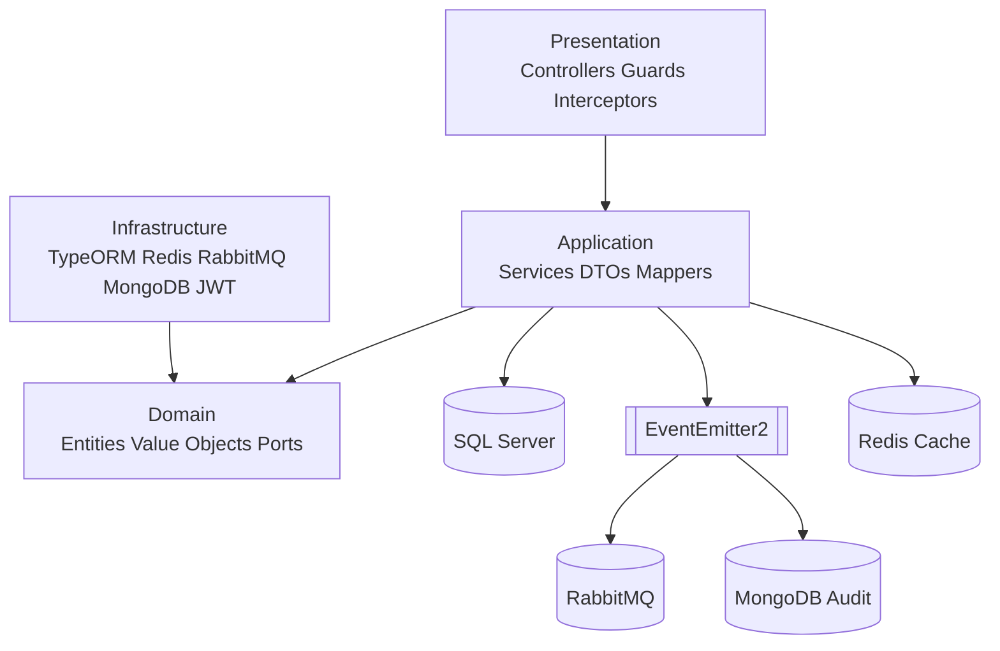

# Aivacol Fleet Management API

Backend de gestão de frota com NestJS, Clean Architecture estrita e foco em qualidade de entrega.

## ✅ Checklist do Desafio

| Requisito                         | Status       | Evidência objetiva                                                |
| --------------------------------- | ------------ | ----------------------------------------------------------------- |
| Clean Architecture e DIP          | ✅ Concluído | Domínio sem imports de framework; portas e adapters implementados |
| CRUD Vehicles                     | ✅ Concluído | Endpoints, services, testes unit/e2e e Swagger                    |
| CRUD Models                       | ✅ Concluído | Endpoints, associação com brand, testes e Swagger                 |
| CRUD Brands                       | ✅ Concluído | Endpoints, testes e Swagger                                       |
| Users + relacionamento            | ✅ Concluído | Seed `aivacol`, `created_by`, consultas protegidas                |
| JWT nas rotas protegidas          | ✅ Concluído | Guard global; única rota pública `POST /api/v1/auth/login`        |
| Redis cache em vehicles           | ✅ Concluído | Cache em lista/item + invalidação por pattern                     |
| RabbitMQ para events de vehicles  | ✅ Concluído | Publicação em `vehicle.created` e `vehicle.updated`               |
| Auditoria MongoDB                 | ✅ Concluído | `audit.service_interaction` para `AUTH`, `READ` e `MUTATION`      |
| Soft delete + unicidade de ativos | ✅ Concluído | Índices únicos filtrados em migrations SQL raw                    |
| Swagger/OpenAPI                   | ✅ Concluído | `/api/docs` com contratos e respostas de erro                     |
| Postman collection final          | ✅ Concluído | `aivacol-postman-collection.json` na raiz                         |
| Benchmark cache quente vs frio    | ✅ Concluído | `scripts/benchmark.ps1` com comparação Warm x Cold                |
| Docker multistage + Compose       | ✅ Concluído | Stack completa + profile `tools`                                  |
| Testes e cobertura                | ✅ Concluído | `test`, `test:e2e`, `test:cov` com thresholds atendidos           |
| CI GitHub Actions                 | ✅ Concluído | `.github/workflows/ci.yml` com lint/typecheck/test                |
| Rate limiting global              | ✅ Concluído | Guard global + erro `RATE_LIMIT_EXCEEDED`                         |

## 1) Visão geral

- Escopo funcional: autenticação JWT, CRUD de `vehicles`, `models`, `brands`, consulta protegida de `users` e health check protegido.
- Dados e integrações: SQL Server (principal), Redis (cache), RabbitMQ (eventos), MongoDB (auditoria).
- Observabilidade: correlation ID, logging interceptor, exception filter global e catálogo de erros estável.
- Qualidade: suites unitárias e e2e com cobertura global ≥ 90% em lines/functions/statements.

## 2) Arquitetura



ADRs relacionados:

- `docs/adr/ADR-001-clean-architecture.md`
- `docs/adr/ADR-002-event-driven-decoupling.md`
- `docs/adr/ADR-003-data-lifecycle-soft-delete-and-audit.md`
- `docs/adr/ADR-004-sqlserver-filtered-unique-indexes-with-typeorm.md`

## 3) Tecnologias e versões principais

| Componente          | Versão              |
| ------------------- | ------------------- |
| Node.js (container) | 18                  |
| NestJS              | 10.4.20             |
| TypeScript          | 5.5.4               |
| TypeORM             | 0.3.20              |
| SQL Server (Docker) | 2022-latest         |
| Redis (Docker)      | 7-alpine            |
| RabbitMQ (Docker)   | 3-management-alpine |
| MongoDB (Docker)    | 7                   |
| Jest                | 29.7.0              |
| Autocannon          | 7.14.0              |

## 4) Pré-requisitos

- Docker Desktop
- Git
- PowerShell 7.5+

## 5) Como subir o ambiente

```powershell
docker compose up --build -d
docker compose ps
```

- API: `http://localhost:3000/api/v1`
- Swagger: `http://localhost:3000/api/docs`

## 6) Migrations e seed

```powershell
docker compose run --rm app npm run migration:run
docker compose run --rm app npm run seed
```

Usuário seed padrão:

- `nickname`: `aivacol`
- `password`: valor de `SEED_USER_PASSWORD` no `.env`

## 7) Qualidade, testes e cobertura

```powershell
docker compose exec app npm run lint
docker compose exec app npm run lint:fix
docker compose exec app npm run typecheck
docker compose exec app npm run test
docker compose exec app npm run test:e2e
docker compose exec app npm run test:cov
```

Thresholds:

- Branches ≥ 80%
- Functions ≥ 90%
- Lines ≥ 90%
- Statements ≥ 90%

## 8) Benchmark oficial

Ponto de entrada:

```powershell
./scripts/benchmark.ps1
```

Fluxo do benchmark:

- Runner dedicado `benchmark-runner` (`docker compose --profile tools run --rm ...`)
- Target interno `http://app:3000`
- Cenários: `warm cache` e `cold cache`

Resultado oficial da Fase 8 (última execução válida):

- Warm cache: `requestsAvg=764`, `p50=37ms`, `p99=60ms`, `errors=0`, `non2xx=0`
- Cold cache: `requestsAvg=696.8`, `p50=33ms`, `p99=132ms`, `errors=0`, `non2xx=0`
- Diferença: throughput `+8.8%` no warm cache e p99 significativamente menor (`60ms` vs `132ms`)

### Observação sobre throttling dinâmico por ambiente

- `THROTTLE_TTL_SECONDS` e `THROTTLE_LIMIT` devem ser calibrados por demanda de cada ambiente.
- Em benchmark/carga sintética, é aceitável elevar temporariamente `THROTTLE_LIMIT` para evitar `429` artificiais.
- Após o benchmark, o valor padrão deve ser restaurado.
- Nesta entrega final, o `.env` está com padrão restaurado: `THROTTLE_LIMIT=100`.

## 9) Endpoints principais

Base: `/api/v1`

| Grupo    | Método | Endpoint        | Auth   |
| -------- | ------ | --------------- | ------ |
| Auth     | POST   | `/auth/login`   | Public |
| Vehicles | GET    | `/vehicles`     | Bearer |
| Vehicles | GET    | `/vehicles/:id` | Bearer |
| Vehicles | POST   | `/vehicles`     | Bearer |
| Vehicles | PATCH  | `/vehicles/:id` | Bearer |
| Vehicles | DELETE | `/vehicles/:id` | Bearer |
| Models   | GET    | `/models`       | Bearer |
| Models   | GET    | `/models/:id`   | Bearer |
| Models   | POST   | `/models`       | Bearer |
| Models   | PATCH  | `/models/:id`   | Bearer |
| Models   | DELETE | `/models/:id`   | Bearer |
| Brands   | GET    | `/brands`       | Bearer |
| Brands   | GET    | `/brands/:id`   | Bearer |
| Brands   | POST   | `/brands`       | Bearer |
| Brands   | PATCH  | `/brands/:id`   | Bearer |
| Brands   | DELETE | `/brands/:id`   | Bearer |
| Users    | GET    | `/users`        | Bearer |
| Users    | GET    | `/users/:id`    | Bearer |
| Health   | GET    | `/health`       | Bearer |

## 10) Variáveis de ambiente

Consulte `.env.example` para o template completo e os placeholders seguros.

Variáveis críticas de rate limiting:

- `THROTTLE_TTL_SECONDS` (default: `60`)
- `THROTTLE_LIMIT` (default: `100`)

## 11) Catálogo de erros

| Code                      | HTTP | Message                                                      |
| ------------------------- | ---- | ------------------------------------------------------------ |
| `INVALID_CREDENTIALS`     | 401  | Nickname ou senha inválidos                                  |
| `UNAUTHORIZED`            | 401  | Token ausente ou inválido                                    |
| `FORBIDDEN`               | 403  | Você não tem permissão para este recurso                     |
| `VEHICLE_NOT_FOUND`       | 404  | Veículo não encontrado                                       |
| `MODEL_NOT_FOUND`         | 404  | Modelo não encontrado                                        |
| `BRAND_NOT_FOUND`         | 404  | Marca não encontrada                                         |
| `USER_NOT_FOUND`          | 404  | Usuário não encontrado                                       |
| `DUPLICATE_LICENSE_PLATE` | 409  | Placa já cadastrada                                          |
| `DUPLICATE_CHASSIS`       | 409  | Chassi já cadastrado                                         |
| `DUPLICATE_RENAVAM`       | 409  | Renavam já cadastrado                                        |
| `DUPLICATE_MODEL_NAME`    | 409  | Modelo já cadastrado para esta marca                         |
| `DUPLICATE_BRAND_NAME`    | 409  | Marca já cadastrada                                          |
| `RATE_LIMIT_EXCEEDED`     | 429  | Limite de requisições excedido, tente novamente em instantes |
| `INTERNAL_SERVER_ERROR`   | 500  | Erro interno do servidor                                     |

## 🚀 Diferenciais de Engenharia

- Contrato de erro estável por `code`, com padronização de resposta e rastreabilidade.
- Resiliência por design: falhas de Redis/Rabbit/Mongo não derrubam a transação principal no SQL Server.
- Eventos desacoplados com `EventEmitter2`, `correlationId` e `eventId`.
- Soft delete com unicidade de ativos por índices filtrados (ADR-004).
- Benchmark executado em runner dedicado para reduzir distorções.
- Governança de fase com trilha em `task.md`, `struct.md` e `ACHIEVEMENTS.md`.

## CI da Fase 8

- Workflow: `.github/workflows/ci.yml`
- Trigger: push e pull_request para `main`
- Etapas: `checkout -> setup-node -> npm ci -> lint -> typecheck -> test`
