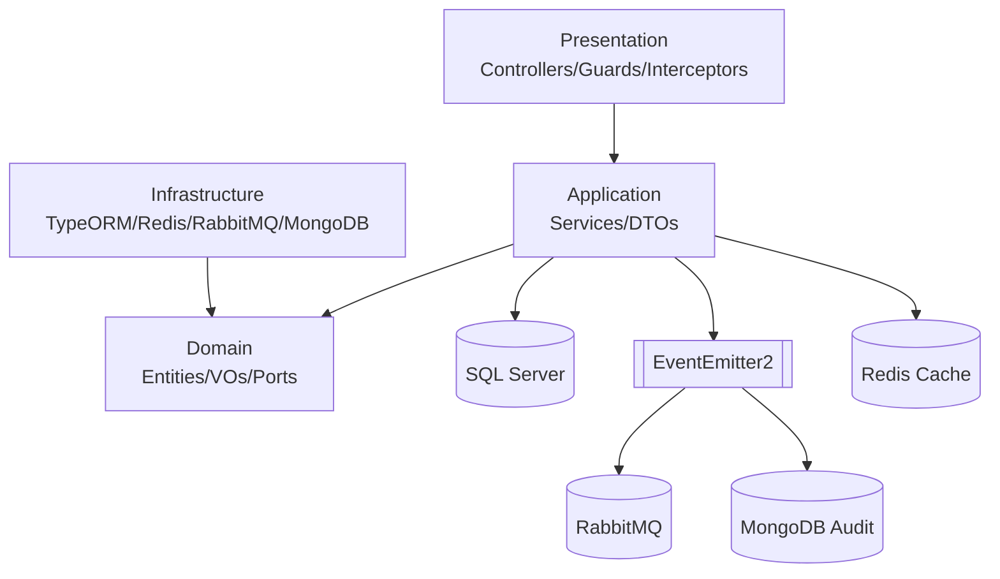

# Aivacol Fleet Management API

Backend do módulo de Gestão de Frota da Aivacol, desenvolvido para o teste técnico de Backend.

> Com o fechamento da Fase 9 (QA/performance baseline), o responsável técnico declara a entrega **v1.0** alcançada para o escopo deste desafio.

## 🎯 Resposta direta às 5 exigências principais do desafio

### 1) Arquitetura limpa

- Implementação em camadas (`Domain`, `Application`, `Presentation`, `Infrastructure`) com desacoplamento por portas/adapters.
- Domínio sem dependência direta de framework, com regras de negócio isoladas.
- Decisões arquiteturais formalizadas em ADRs.

### 2) Segurança robusta

- JWT obrigatório nas rotas protegidas.
- Rate limiting global por ambiente (`THROTTLE_TTL_SECONDS`, `THROTTLE_LIMIT`).
- Tratamento padronizado de erros com `code` estável e `correlationId`.

### 3) Testes automatizados

- Suites unitárias e E2E passando.
- Cobertura global acima dos thresholds definidos (`lines/functions/statements >= 90%`, `branches >= 80%`).
- Gates de qualidade (`lint`, `typecheck`, testes) validados localmente e no CI.

### 4) Escalabilidade

- Cache Redis em leitura de veículos com invalidação automática.
- Mensageria RabbitMQ para eventos de integração sem bloquear transação principal.
- Baseline de performance com cenários `cold`, `warm`, `capacity` e `write-focused`.

### 5) Padronização da modelagem

- Metadados obrigatórios (`created_at`, `updated_at`, `created_by`) na modelagem persistida.
- Soft delete com unicidade de ativos no SQL Server via índices filtrados (`deleted_at IS NULL`).
- Value Objects para campos críticos (`license plate`, `chassis`, `renavam`).

## ✅ Checklist do Desafio (Obrigatórios + Bônus + Diferenciais)

| Critério                                                          | Status | Observação objetiva                    |
| ----------------------------------------------------------------- | ------ | -------------------------------------- |
| Node.js 18+                                                       | ✅     | Runtime em container                   |
| NestJS 10+                                                        | ✅     | Framework principal da API             |
| TypeORM + SQL Server                                              | ✅     | Persistência relacional com migrations |
| JWT obrigatório                                                   | ✅     | Login + proteção das rotas de negócio  |
| Seed com usuário padrão `aivacol`                                 | ✅     | Seed idempotente                       |
| `models` (obrigatório)                                            | ✅     | CRUD completo + metadados              |
| `vehicles` (obrigatório)                                          | ✅     | CRUD completo + metadados              |
| Metadados obrigatórios (`created_at`, `updated_at`, `created_by`) | ✅     | Aplicados na modelagem                 |
| Cache Redis em consultas de veículos                              | ✅     | Listagem e busca por ID                |
| Expiração de cache via env                                        | ✅     | TTL configurável                       |
| Invalidação automática de cache em mutações                       | ✅     | `create/update/delete`                 |
| Testes automatizados (Jest unit + e2e)                            | ✅     | Suites verdes                          |
| Tratamento de erros e exceções                                    | ✅     | Filtro global + catálogo estável       |
| Boas práticas REST                                                | ✅     | Contratos e status codes consistentes  |
| `seed_vehicles.json` no repositório                               | ✅     | Arquivo presente na raiz               |
| Scripts de execução para avaliador                                | ✅     | Scripts PowerShell + Docker            |

## 🚀 Bônus e diferenciais implementados

| Item                                      | Status | Observação                                                                                                                           |
| ----------------------------------------- | ------ | ------------------------------------------------------------------------------------------------------------------------------------ |
| Health check protegido                    | ✅     | `/api/v1/health` com validação de conectores                                                                                         |
| Swagger/OpenAPI                           | ✅     | `/api/docs`                                                                                                                          |
| Postman collection final                  | ✅     | Fluxo com token automático                                                                                                           |
| Dockerfile multistage                     | ✅     | `dev`, `builder`, `production`                                                                                                       |
| Docker Compose completo                   | ✅     | app + SQL Server + Redis + RabbitMQ + MongoDB + benchmark runner                                                                     |
| CI (GitHub Actions)                       | ✅     | `lint`, `typecheck`, `test` em push/PR para `main`                                                                                   |
| ADRs + trade-offs/drawbacks               | ✅     | `docs/adr/*`                                                                                                                         |
| Benchmark quente/frio + stress/capacidade | ✅     | Evidenciado em `docs/performance-baseline-phase-9.md`                                                                                |
| Baseline/manifesto de performance         | ✅     | `docs/performance-baseline-phase-9.md`                                                                                               |
| Governança e handoff técnico              | ✅     | `MASTER.md`, `implementation_plan.md`, `task.md`, `struct.md`, `ACHIEVEMENTS.md`                                                     |
| Linting e qualidade de código             | ✅     | ESLint + lint:fix + typecheck como gate técnico de QA contínuo                                                                       |
| Mensageria (RabbitMQ)                     | ✅     | Eventos assíncronos de veículos com retry/backoff e fallback em DLQ para integração resiliente `vehicle.created` e `vehicle.updated` |
| Governança por PR e manifestos de fase    | ✅     | Entregas segmentadas com evidências por etapa `ACHIEVEMENTS.md` e revisão técnica orientada por checklist `task.md`                  |
| Code review orientado por checklist       | ✅     | Critérios de qualidade, risco e rastreabilidade aplicados antes de merge em main                                                     |
| Coverage mínimo atingido                  | ✅     | `>=90%` lines/functions/statements e `>=80%` branches                                                                                |

### Por que optei por esses extras?

Os itens bônus foram implementados para reduzir risco técnico e aumentar a qualidade de manutenção do projeto:

- Mensageria e auditoria melhoram rastreabilidade e desacoplamento de responsabilidades.
- CI e suíte de testes robusta aumentam confiança para evolução contínua.
- Swagger e Postman melhoram experiência de validação para recrutador/avaliador.
- Benchmark estruturado permite evidenciar impacto real de cache em desempenho.

Essas decisões estão alinhadas ao planejamento (`MASTER.md`, `implementation_plan.md`, `task.md`) e aos ADRs do projeto.

## Sumário

- [1) Visão geral](#1-visão-geral)
- [2) Arquitetura e decisões](#2-arquitetura-e-decisões)
- [3) Segurança ponta a ponta](#3-segurança-ponta-a-ponta)
- [4) Escalabilidade e performance](#4-escalabilidade-e-performance)
- [5) Tecnologias](#5-tecnologias)
- [6) Como executar (rápido)](#6-como-executar-rápido)
- [7) Scripts para o recrutador](#7-scripts-para-o-recrutador)
- [8) Migrations e seed](#8-migrations-e-seed)
- [9) Testes e qualidade](#9-testes-e-qualidade)
- [10) Benchmark](#10-benchmark)
- [11) Endpoints principais](#11-endpoints-principais)
- [12) Variáveis de ambiente](#12-variáveis-de-ambiente)
- [13) Catálogo de erros](#13-catálogo-de-erros)
- [14) CI/CD](#14-cicd)
- [15) Postman](#15-postman)
- [16) Rastreabilidade e documentação](#16-rastreabilidade-e-documentação)
- [17) Como continuar com IA](#17-como-continuar-com-ia)
- [18) Nota de segurança e compliance](#18-nota-de-segurança-e-compliance)
- [19) Contato técnico](#19-contato-técnico)

## 1) Visão geral

A API entrega:

- Autenticação JWT.
- CRUD de `vehicles` e `models` (escopo obrigatório).
- CRUD de `brands` e consulta protegida de `users` (bônus).
- Cache Redis em consultas de veículos.
- Eventos de veículos via RabbitMQ.
- Auditoria de interações de serviço via MongoDB.
- Contrato de erro estável com `code` e mensagens em PT-BR.

## 2) Arquitetura e decisões

Arquitetura baseada em Clean Architecture com separação de responsabilidades:

- **Domain**: entidades, value objects, regras de negócio e portas.
- **Application**: casos de uso, DTOs e orquestração.
- **Presentation**: controllers e contratos HTTP.
- **Infrastructure**: TypeORM, Redis, RabbitMQ, MongoDB e integrações externas.



### ADRs (decisões arquiteturais)

- `docs/adr/ADR-001-clean-architecture.md`
- `docs/adr/ADR-002-event-driven-decoupling.md`
- `docs/adr/ADR-003-data-lifecycle-soft-delete-and-audit.md`
- `docs/adr/ADR-004-sqlserver-filtered-unique-indexes-with-typeorm.md`

### Papel do RabbitMQ e do MongoDB na arquitetura

- **RabbitMQ**: canal de integração assíncrona para eventos de domínio de veículos (`vehicle.created`, `vehicle.updated`), com retry/backoff e fallback para DLQ. Não é, nesta versão, fila de comando de escrita principal da API.
- **MongoDB**: trilha de auditoria (`audit.service_interaction`) para rastreabilidade operacional e observabilidade de interações de serviço, complementar ao banco transacional.

## 3) Segurança ponta a ponta

- JWT obrigatório em rotas protegidas.
- Rate limiting global por ambiente.
- Exceções padronizadas com `code` estável e `correlationId`.
- Health check protegido com diagnóstico de dependências.

## 4) Escalabilidade e performance

- Cache Redis em leitura com invalidação automática.
- RabbitMQ para integração assíncrona de eventos de veículo.
- Baseline oficial e histórico de benchmark em `docs/performance-baseline-phase-9.md`.

Próximos passos naturais para evolução de desempenho:

- escalar leitura com réplicas e balanceamento;
- reduzir custo de serialização/payload em endpoints críticos;
- avaliar fluxo assíncrono de escrita com `202 Accepted` + fila, caso o contrato de produto permita;
- manter baseline before/after em cada rodada de tuning.

## 5) Tecnologias

- Node.js 18+
- NestJS 10+
- TypeORM
- SQL Server
- Redis
- RabbitMQ
- MongoDB
- JWT
- Jest

## 6) Como executar (rápido)

```powershell
docker compose up --build -d
docker compose ps
```

Acessos:

- API: `http://localhost:3000/api/v1`
- Swagger: `http://localhost:3000/api/docs`

## 7) Scripts para o recrutador

| Script                  | Finalidade                                                 |
| ----------------------- | ---------------------------------------------------------- |
| `scripts/dev.ps1`       | Sobe o ambiente completo                                   |
| `scripts/stop.ps1`      | Para o ambiente                                            |
| `scripts/logs.ps1`      | Exibe logs do app                                          |
| `scripts/lint.ps1`      | Executa `lint` + `lint:fix` + `typecheck`                  |
| `scripts/test.ps1`      | Executa testes com cobertura                               |
| `scripts/test-e2e.ps1`  | Executa testes E2E                                         |
| `scripts/migrate.ps1`   | Executa migrations                                         |
| `scripts/seed.ps1`      | Executa seed idempotente                                   |
| `scripts/benchmark.ps1` | Executa benchmark (`-Mode read` e `-Mode write`)           |
| `scripts/db.ps1`        | Consulta SQL Server (status/migrations/contagens/veículos) |

## 8) Migrations e seed

```powershell
docker compose run --rm app npm run migration:run
docker compose run --rm app npm run seed
```

Usuário seed padrão (local):

- `nickname`: `aivacol`
- `password`: valor de `SEED_USER_PASSWORD` no `.env`

Consultas rápidas no SQL Server (via container):

```powershell
./scripts/db.ps1 -Action status
./scripts/db.ps1 -Action migrations
./scripts/db.ps1 -Action counts
./scripts/db.ps1 -Action vehicles -Top 10
./scripts/db.ps1 -Action sql -Sql "SELECT TOP 5 id, license_plate FROM vehicles ORDER BY created_at DESC"
```

## 9) Testes e qualidade

```powershell
docker compose exec app npm run lint
docker compose exec app npm run lint:fix
docker compose exec app npm run typecheck
docker compose exec app npm run test
docker compose exec app npm run test:e2e
docker compose exec app npm run test:cov
```

Cobertura reportada:

- Statements: **95.22%**
- Branches: **84.59%**
- Functions: **94.85%**
- Lines: **94.91%**

## 10) Benchmark

Ponto de entrada oficial:

```powershell
./scripts/benchmark.ps1 -Mode read
./scripts/benchmark.ps1 -Mode write
```

Execução em runner dedicado (`benchmark-runner`) com target interno `http://app:3000`.

Resumo atual (dev rápido):

- Read (`-Mode read`): warm ~`760 RPS` com `p99 ~78ms`; capacity ~`773 RPS` com `p99 ~249ms`.
- Write (`-Mode write`, isolado): ~`118 RPS` com `p99 ~510ms`.

Documentação completa da Fase 9 (metodologia, histórico de tentativas, baseline oficial/dev e análise de capacidade):

- `docs/performance-baseline-phase-9.md`

Resultado oficial registrado:

- Warm cache: `requestsAvg=764`, `p50=37ms`, `p99=60ms`, `errors=0`, `non2xx=0`
- Cold cache: `requestsAvg=696.8`, `p50=33ms`, `p99=132ms`, `errors=0`, `non2xx=0`
- Diferença: throughput warm `+8.8%`, com p99 significativamente melhor em warm.

### Nota sobre rate limiting e benchmark

O throttling é configurável por ambiente via `THROTTLE_TTL_SECONDS` e `THROTTLE_LIMIT`.

- Em uso normal da API, use limites conservadores (ex.: `THROTTLE_LIMIT=100`).
- Em benchmark/carga sintética, pode ser necessário elevar temporariamente (ex.: `THROTTLE_LIMIT=50000`) para evitar `429` artificiais durante a medição.
- Após benchmark, restaure o valor padrão do ambiente.

## 11) Endpoints principais

Base: `/api/v1`

- `POST /auth/login` (público)
- `GET/POST/PATCH/DELETE /vehicles` (Bearer)
- `GET/POST/PATCH/DELETE /models` (Bearer)
- `GET/POST/PATCH/DELETE /brands` (Bearer)
- `GET /users` e `GET /users/:id` (Bearer)
- `GET /health` (Bearer)

## 12) Variáveis de ambiente

Referência completa em `.env.example`.

Principais:

- App: `APP_PORT`, `NODE_ENV`, `CORS_ORIGINS`
- SQL Server: `DB_HOST`, `DB_PORT`, `DB_USERNAME`, `DB_PASSWORD`, `DB_DATABASE`
- Redis: `REDIS_HOST`, `REDIS_PORT`, `CACHE_TTL`
- RabbitMQ: `RABBITMQ_HOST`, `RABBITMQ_PORT`, `RABBITMQ_USER`, `RABBITMQ_PASS`
- MongoDB: `MONGO_URI`
- Auth: `JWT_SECRET`, `JWT_EXPIRES_IN`
- Throttling: `THROTTLE_TTL_SECONDS`, `THROTTLE_LIMIT`
- Seed: `SEED_USER_NICKNAME`, `SEED_USER_EMAIL`, `SEED_USER_PASSWORD`
- Benchmark: `BENCHMARK_BASE_URL`, `BENCHMARK_DURATION_SECONDS`, `BENCHMARK_CONNECTIONS`

## 13) Catálogo de erros

- `INVALID_CREDENTIALS` (401)
- `UNAUTHORIZED` (401)
- `VEHICLE_NOT_FOUND` (404)
- `MODEL_NOT_FOUND` (404)
- `BRAND_NOT_FOUND` (404)
- `USER_NOT_FOUND` (404)
- `DUPLICATE_LICENSE_PLATE` (409)
- `DUPLICATE_CHASSIS` (409)
- `DUPLICATE_RENAVAM` (409)
- `DUPLICATE_MODEL_NAME` (409)
- `DUPLICATE_BRAND_NAME` (409)
- `RATE_LIMIT_EXCEEDED` (429)
- `INTERNAL_SERVER_ERROR` (500)

## 14) CI/CD

Pipeline em `.github/workflows/ci.yml`:

- Trigger: `push` e `pull_request` para `main`
- Etapas: `npm ci` -> `lint` -> `typecheck` -> `test`

## 15) Postman

Coleção final na raiz:

- `aivacol-postman-collection.json`

Contém:

- variáveis (`base_url`, `nickname`, `password`, `token`);
- pre-request script para auto-login/token;
- pastas por domínio;
- exemplos de respostas de sucesso e erro.

## 16) Rastreabilidade e documentação

- Planejamento e governança: `MASTER.md`, `implementation_plan.md`, `task.md`
- Mapa estrutural: `struct.md`
- Registro de execução por fase: `ACHIEVEMENTS.md`
- Baseline/manifesto de performance: `docs/performance-baseline-phase-9.md`
- ADRs: `docs/adr/*`
- Runbook operacional: `docs/runbooks/infra-contingency.md`

## 17) Como continuar com IA

Protocolo mínimo por sessão (obrigatório):

1. Ler `MASTER.md`
2. Ler `implementation_plan.md`
3. Ler `task.md`
4. Ler `struct.md`
5. Ler `ACHIEVEMENTS.md`
6. Executar `git status`
7. Executar `git log --oneline -5`
8. Revisar seção de Qualidade/Governança do `MASTER.md`

Regras de continuidade:

- Trabalhar em branch dedicada por fase/objetivo.
- Não executar `npm install` no host (somente em container).
- Não usar scripts bash no host (fluxo local em PowerShell).
- Atualizar sempre `task.md`, `struct.md` e `ACHIEVEMENTS.md` com evidências reais.
- Não marcar checklist sem validação objetiva.

## 18) Nota de segurança e compliance

O escopo desta entrega seguiu o desafio com segurança obrigatória (JWT e rotas protegidas).

Como evolução para cenário de produto com usuários finais, recomenda-se:

- autorização por ownership/tenant para dados de frota;
- RBAC (controle por papéis);
- revisão periódica de segredos e políticas de acesso.

Essas evoluções reforçam aderência à LGPD e boas práticas de compliance no contexto brasileiro.

## 19) Contato técnico

**Daniel de Queiroz Reis**  
[danielqreis@gmail.com](mailto:danielqreis@gmail.com) | [WhatsApp (+55 35 99190-2471)](https://wa.me/5535991902471)  
[LinkedIn](https://www.linkedin.com/in/danielqreis/) | [GitHub](https://github.com/Daniel-Q-Reis)
