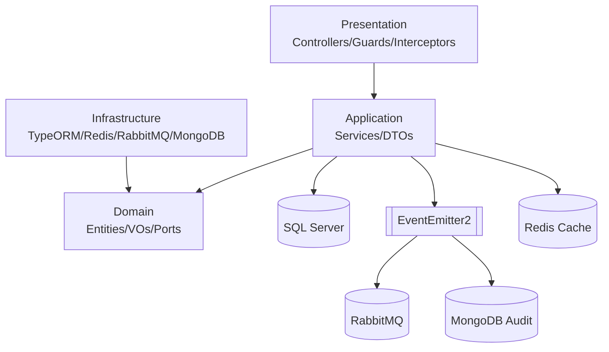

# Aivacol Fleet Management API

Backend do módulo de Gestão de Frota da Aivacol, desenvolvido para o teste técnico de Backend.

> Este projeto foi conduzido para atender integralmente o escopo original (nível pleno), com implementação de diferenciais técnicos para elevar robustez, testabilidade e previsibilidade operacional dentro da janela de tempo disponível.

## ✅ Checklist do Desafio (Escopo Original)

| Critério | Status | Observação |
|---|---|---|
| Node.js 18+ | ✅ | Runtime em container |
| NestJS 10+ | ✅ | Framework principal da API |
| TypeORM + SQL Server | ✅ | Persistência relacional com migrations |
| JWT obrigatório | ✅ | Login e proteção das rotas de negócio |
| Seed com usuário padrão `aivacol` | ✅ | Seed idempotente |
| Tabela `models` (obrigatória) | ✅ | CRUD completo + metadados |
| Tabela `vehicles` (obrigatória) | ✅ | CRUD completo + metadados |
| Metadados obrigatórios (`created_at`, `updated_at`, `created_by`) | ✅ | Aplicados nas entidades persistidas |
| Gestão de `models` (criar/atualizar/consultar/remover) | ✅ | Endpoints e regras implementados |
| Gestão de `vehicles` (registrar/atualizar/listar/remover) | ✅ | Endpoints, validações e soft delete |
| Cache Redis em consultas de veículos | ✅ | Cache em listagem e busca por ID |
| Expiração de cache via variável de ambiente | ✅ | TTL configurável por env |
| Invalidação automática do cache de veículos | ✅ | Em create/update/delete |
| Testes automatizados com Jest | ✅ | Unit + E2E |
| Cobertura mínima de regras/serviços/validações/integrações | ✅ | Thresholds atendidos |
| Tratamento de erros e exceções | ✅ | Filtro global + catálogo estável de erros |
| Boas práticas REST (status codes/contratos) | ✅ | Contratos padronizados |
| `seed_vehicles.json` no repositório | ✅ | Arquivo presente na raiz |
| README com instruções claras | ✅ | Execução, testes, benchmark e arquitetura documentados |
| Scripts de execução | ✅ | Scripts PowerShell para ciclo local |

## 🚀 Bônus e Diferenciais Implementados

| Item | Status | Observação |
|---|---|---|
| Gestão de `brands` (bônus) | ✅ | CRUD completo + associação com `models` |
| Gestão de `users` (bônus) | ✅ | Consultas protegidas + relacionamento por `created_by` |
| Mensageria (RabbitMQ) | ✅ | Eventos de veículos (`vehicle.created`, `vehicle.updated`) |
| Auditoria em banco não relacional | ✅ | MongoDB para trilha de interações de serviço |
| Dockerfile multistage | ✅ | Ambientes dev/build/prod |
| Docker Compose completo | ✅ | app + SQL Server + Redis + RabbitMQ + MongoDB + benchmark runner |
| Swagger/OpenAPI | ✅ | `/api/docs` |
| Coleção Postman final | ✅ | Fluxo com token automático |
| CI (GitHub Actions) | ✅ | `lint`, `typecheck`, `test` em push/PR para `main` |
| Benchmark cache quente vs frio | ✅ | Execução oficial e resultados documentados |

### Por que optei por esses extras?

Os itens bônus foram implementados para reduzir risco técnico e aumentar a qualidade de manutenção do projeto:

- Mensageria e auditoria melhoram rastreabilidade e desacoplamento de responsabilidades.
- CI e suíte de testes robusta aumentam confiança para evolução contínua.
- Swagger e Postman melhoram experiência de validação para recrutador/avaliador.
- Benchmark estruturado permite evidenciar impacto real de cache em desempenho.

Essas decisões estão alinhadas ao planejamento (`MASTER.md`, `implementation_plan.md`, `task.md`) e aos ADRs do projeto.

## Sumário

- [1) Visão geral](#1-visão-geral)
- [2) Arquitetura e decisões](#2-arquitetura-e-decisões)
- [3) Tecnologias](#3-tecnologias)
- [4) Como executar (rápido)](#4-como-executar-rápido)
- [5) Scripts para o recrutador](#5-scripts-para-o-recrutador)
- [6) Migrations e seed](#6-migrations-e-seed)
- [7) Testes e qualidade](#7-testes-e-qualidade)
- [8) Benchmark](#8-benchmark)
- [9) Endpoints principais](#9-endpoints-principais)
- [10) Variáveis de ambiente](#10-variáveis-de-ambiente)
- [11) Catálogo de erros](#11-catálogo-de-erros)
- [12) CI/CD](#12-cicd)
- [13) Postman](#13-postman)
- [14) Rastreabilidade e documentação](#14-rastreabilidade-e-documentação)

## 1) Visão geral

A API entrega:

- Autenticação JWT.
- CRUD de `vehicles` e `models` (escopo obrigatório).
- CRUD de `brands` e consulta protegida de `users` (bônus).
- Cache Redis em consultas de veículos.
- Eventos de veículos via RabbitMQ.
- Auditoria de interações de serviço via MongoDB.
- Contrato de erro estável com `code` e mensagens em PT-BR.

## 2) Arquitetura e decisões

Arquitetura baseada em Clean Architecture com separação de responsabilidades:

- **Domain**: entidades, value objects, regras de negócio e portas.
- **Application**: casos de uso, DTOs e orquestração.
- **Presentation**: controllers e contratos HTTP.
- **Infrastructure**: TypeORM, Redis, RabbitMQ, MongoDB e integrações externas.



### ADRs (decisões arquiteturais)

- `docs/adr/ADR-001-clean-architecture.md`
- `docs/adr/ADR-002-event-driven-decoupling.md`
- `docs/adr/ADR-003-data-lifecycle-soft-delete-and-audit.md`
- `docs/adr/ADR-004-sqlserver-filtered-unique-indexes-with-typeorm.md`

## 3) Tecnologias

- Node.js 18+
- NestJS 10+
- TypeORM
- SQL Server
- Redis
- RabbitMQ
- MongoDB
- JWT
- Jest

## 4) Como executar (rápido)

```powershell
docker compose up --build -d
docker compose ps
```

Acessos:

- API: `http://localhost:3000/api/v1`
- Swagger: `http://localhost:3000/api/docs`

## 5) Scripts para o recrutador

Para facilitar validação rápida, os principais scripts PowerShell já estão prontos:

| Script | Finalidade |
|---|---|
| `scripts/dev.ps1` | Sobe o ambiente completo |
| `scripts/stop.ps1` | Para o ambiente |
| `scripts/logs.ps1` | Exibe logs do app |
| `scripts/lint.ps1` | Executa `lint` + `lint:fix` + `typecheck` |
| `scripts/test.ps1` | Executa testes com cobertura |
| `scripts/test-e2e.ps1` | Executa testes E2E |
| `scripts/migrate.ps1` | Executa migrations |
| `scripts/seed.ps1` | Executa seed idempotente |
| `scripts/benchmark.ps1` | Executa benchmark (runner dedicado) |

## 6) Migrations e seed

```powershell
docker compose run --rm app npm run migration:run
docker compose run --rm app npm run seed
```

Usuário seed padrão (local):

- `nickname`: `aivacol`
- `password`: valor de `SEED_USER_PASSWORD` no `.env`

## 7) Testes e qualidade

```powershell
docker compose exec app npm run lint
docker compose exec app npm run lint:fix
docker compose exec app npm run typecheck
docker compose exec app npm run test
docker compose exec app npm run test:e2e
docker compose exec app npm run test:cov
```

Cobertura final atingida:

- Statements: **95.22%**
- Branches: **84.59%**
- Functions: **94.85%**
- Lines: **94.91%**

## 8) Benchmark

Ponto de entrada oficial:

```powershell
./scripts/benchmark.ps1
```

Execução em runner dedicado (`benchmark-runner`) com target interno `http://app:3000`.

Resultado oficial (execução local):

- Warm cache: `requestsAvg=764`, `p50=37ms`, `p99=60ms`, `errors=0`, `non2xx=0`
- Cold cache: `requestsAvg=696.8`, `p50=33ms`, `p99=132ms`, `errors=0`, `non2xx=0`
- Diferença: throughput warm `+8.8%`, com p99 significativamente melhor em warm.

### Nota sobre rate limiting e benchmark

O throttling é configurável por ambiente via `THROTTLE_TTL_SECONDS` e `THROTTLE_LIMIT`.

- Em uso normal da API, use limites conservadores (ex.: `THROTTLE_LIMIT=100`).
- Em benchmark/carga sintética, pode ser necessário elevar temporariamente (ex.: `THROTTLE_LIMIT=50000`) para evitar `429` artificiais durante a medição.
- Após benchmark, restaure o valor padrão do ambiente.

## 9) Endpoints principais

Base: `/api/v1`

- `POST /auth/login` (público)
- `GET/POST/PATCH/DELETE /vehicles` (Bearer)
- `GET/POST/PATCH/DELETE /models` (Bearer)
- `GET/POST/PATCH/DELETE /brands` (Bearer)
- `GET /users` e `GET /users/:id` (Bearer)
- `GET /health` (Bearer)

## 10) Variáveis de ambiente

Referência completa em `.env.example`.

Principais:

- App: `APP_PORT`, `NODE_ENV`, `CORS_ORIGINS`
- SQL Server: `DB_HOST`, `DB_PORT`, `DB_USERNAME`, `DB_PASSWORD`, `DB_DATABASE`
- Redis: `REDIS_HOST`, `REDIS_PORT`, `CACHE_TTL`
- RabbitMQ: `RABBITMQ_HOST`, `RABBITMQ_PORT`, `RABBITMQ_USER`, `RABBITMQ_PASS`
- MongoDB: `MONGO_URI`
- Auth: `JWT_SECRET`, `JWT_EXPIRES_IN`
- Throttling: `THROTTLE_TTL_SECONDS`, `THROTTLE_LIMIT`
- Seed: `SEED_USER_NICKNAME`, `SEED_USER_EMAIL`, `SEED_USER_PASSWORD`
- Benchmark: `BENCHMARK_BASE_URL`, `BENCHMARK_DURATION_SECONDS`, `BENCHMARK_CONNECTIONS`

## 11) Catálogo de erros

Códigos estáveis de referência:

- `INVALID_CREDENTIALS` (401)
- `UNAUTHORIZED` (401)
- `VEHICLE_NOT_FOUND` (404)
- `MODEL_NOT_FOUND` (404)
- `BRAND_NOT_FOUND` (404)
- `USER_NOT_FOUND` (404)
- `DUPLICATE_LICENSE_PLATE` (409)
- `DUPLICATE_CHASSIS` (409)
- `DUPLICATE_RENAVAM` (409)
- `DUPLICATE_MODEL_NAME` (409)
- `DUPLICATE_BRAND_NAME` (409)
- `RATE_LIMIT_EXCEEDED` (429)
- `INTERNAL_SERVER_ERROR` (500)

## 12) CI/CD

Pipeline em `.github/workflows/ci.yml`:

- Trigger: `push` e `pull_request` para `main`
- Etapas: `npm ci` -> `lint` -> `typecheck` -> `test`

## 13) Postman

Coleção final na raiz:

- `aivacol-postman-collection.json`

Contém:

- variáveis (`base_url`, `nickname`, `password`, `token`);
- pre-request script para auto-login/token;
- pastas por domínio;
- exemplos de respostas de sucesso e erro.

## 14) Rastreabilidade e documentação

- Planejamento e governança: `MASTER.md`, `implementation_plan.md`, `task.md`
- Mapa estrutural: `struct.md`
- Registro de execução por fase: `ACHIEVEMENTS.md`
- ADRs: `docs/adr/*`
- Runbook operacional: `docs/runbooks/infra-contingency.md`
